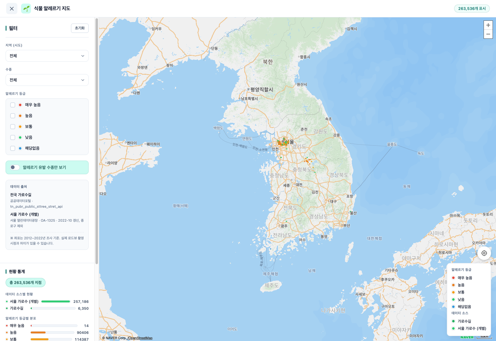
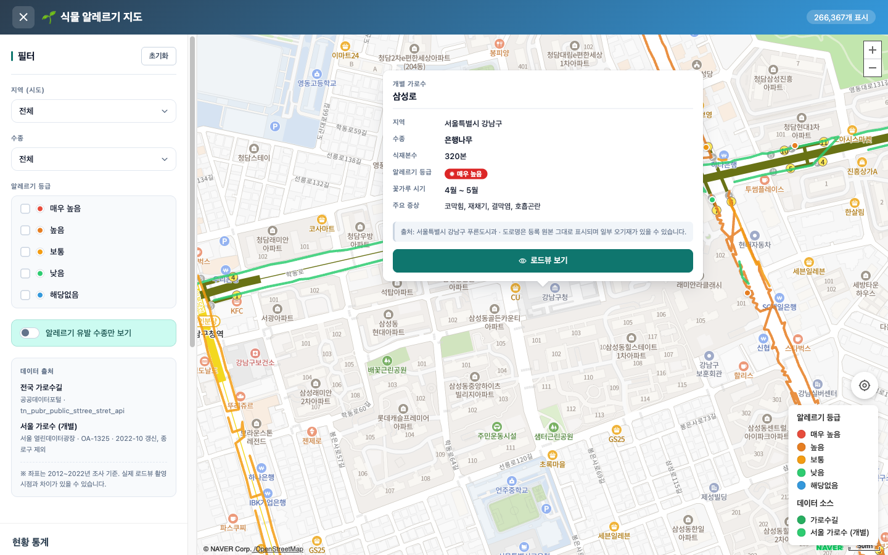
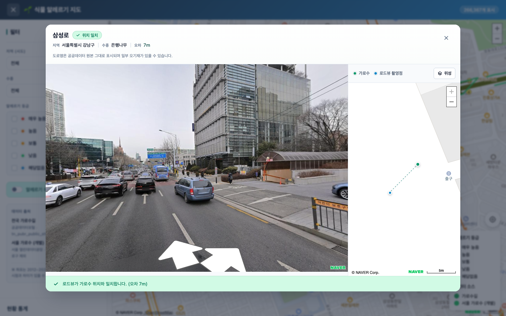

# 🌳 가로수길 알레르기 지도 (pollen-map)

**한국어** · [English](README.en.md)

전국 가로수 분포와 **알레르기 유발 수종**을 지도 위에 시각화하는 웹 서비스입니다.
식물 알레르기 환자와 의료진이 주변 가로수의 수종·알레르기 등급·꽃가루 시기를 한눈에 확인하고, 로드뷰로 실제 위치를 살펴볼 수 있습니다.

**🔗 배포:** https://pollen-map-dun.vercel.app

---

## 📸 미리보기

| 전국 가로수 지도 | 마커 팝업 (알레르기 정보) | 로드뷰 연동 |
|:---:|:---:|:---:|
|  |  |  |

## ✨ 주요 기능

- **전국 가로수 지도** — 공공데이터 가로수길 정보 약 10,350건 + 서울 개별 가로수 약 257,000그루
- **알레르기 등급 표시** — 수종별 알레르기 항원 등급(매우 높음 ~ 해당없음)과 꽃가루 발생 시기 안내
- **스마트 필터** — 시·도, 수종, 알레르기 등급, 알레르기 유발종만 보기
- **로드뷰 연동** — 마커 클릭 시 Naver 파노라마로 실제 가로수 위치 확인
- **도로·수종 단위 폴리라인** — 같은 도로의 연속된 동일 수종을 선으로 묶어 가독성·성능 확보
- **뷰포트 기반 렌더링 + 클러스터링** — 대용량 데이터를 부드럽게 탐색
- **2단계 로딩 + 캐시** — 캐시 즉시 표시 후 백그라운드 갱신

## 🛠️ 기술 스택

| 분류 | 사용 기술 |
|------|-----------|
| Frontend | React 19, Vite 8 |
| 지도 | Naver Maps API v3 (Panorama 서브모듈) |
| 클러스터링 | Naver MarkerClustering.js (로컬 호스팅) |
| 데이터 처리 | Web Worker (도로·수종 그룹화), IndexedDB 캐시 |
| 배포 | Vercel (git push 자동 배포) |

## 🗂️ 데이터 소스

| 소스 | 제공처 | 규모 | 단위 |
|------|--------|------|------|
| 전국 가로수길 정보 | [공공데이터포털](https://www.data.go.kr) `tn_pubr_public_sttree_stret_api` | 약 10,350건 | 구간 |
| 서울 가로수 위치정보 | [서울 열린데이터광장](https://data.seoul.go.kr) OA-1325 `GeoInfoOfRoadsideTreeW` | 약 257,000그루 | 개별 그루 |

- 서울은 개별 그루 데이터로 치환하고, 그 외 지역은 구간 단위 소스를 사용합니다.
- 서울 데이터는 런타임 API 호출 대신 사전 수집한 정적 JSON(`public/data/seoul-trees.json`)으로 배포됩니다.

> ⚠️ 가로수 위치·수종 정보는 자치단체 등록 데이터를 기반으로 하며 일부 오기재가 있을 수 있습니다. 알레르기 등급은 일반적인 참고 정보로, 의학적 진단을 대체하지 않습니다.

## 🚀 시작하기

### 사전 준비

- Node.js 18+
- [공공데이터포털](https://www.data.go.kr) 오픈API 인증키 (가로수길 표준데이터 활용신청)

### 설치 및 실행

```bash
# 의존성 설치
npm install

# 환경변수 설정
cp .env.example .env
# .env 파일에 VITE_DATA_API_KEY 값을 입력하세요

# 개발 서버 실행
npm run dev

# 프로덕션 빌드
npm run build

# 빌드 미리보기
npm run preview
```

### 환경변수

| 변수 | 설명 |
|------|------|
| `VITE_DATA_API_KEY` | 공공데이터포털 오픈API 인증키 (가로수길 데이터 공통) |

Naver Maps 클라이언트 키는 `index.html`의 스크립트 태그(`ncpKeyId`)로 로드됩니다.

### 서울 데이터 갱신

서울 가로수 데이터를 최신화하려면:

```bash
node scripts/fetch-seoul-trees.mjs   # public/data/seoul-trees.json 재생성
```

## 📁 프로젝트 구조

```
repo/
├── public/
│   ├── data/seoul-trees.json     # 서울 개별 가로수 정적 데이터
│   └── MarkerClustering.js       # Naver 클러스터링 (로컬 호스팅)
├── scripts/
│   └── fetch-seoul-trees.mjs     # 서울 데이터 사전 수집 스크립트
├── src/
│   ├── components/               # Map, FilterPanel, StatsPanel, Legend, StreetViewModal
│   ├── data/allergenDatabase.js  # 수종별 알레르기 항원 DB
│   ├── services/                 # api, cache, idbCache, dataSources, normalizers
│   ├── utils/                    # groupByRoad, helpers
│   ├── workers/groupWorker.js    # 도로·수종 그룹화 Web Worker
│   └── App.jsx
└── index.html
```

## 📜 라이선스

가로수 데이터는 공공데이터포털 및 서울 열린데이터광장의 공공누리 이용약관을 따릅니다.
